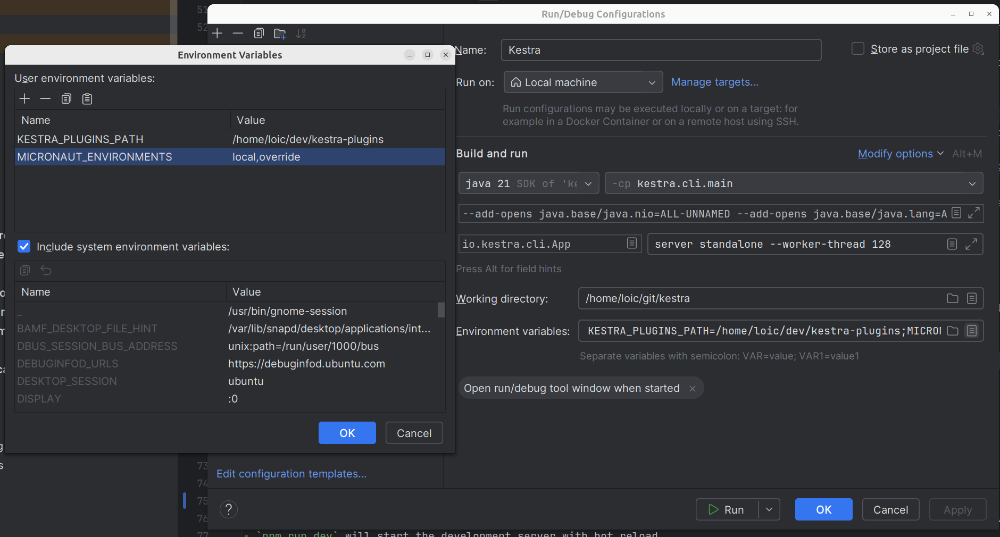
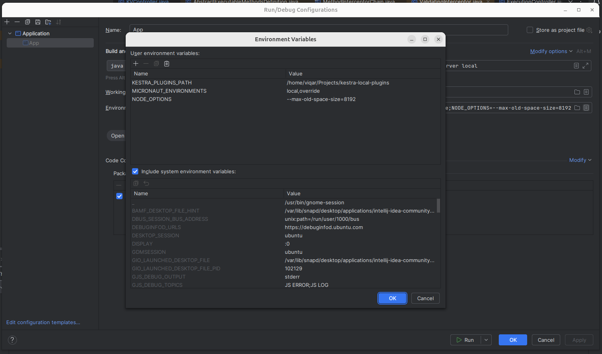

## Code of Conduct

This project and everyone participating in it is governed by the
[Kestra Code of Conduct](https://github.com/kestra-io/kestra/blob/develop/.github/CODE_OF_CONDUCT.md).
By participating, you are expected to uphold this code. Please report unacceptable behavior
to <hello@kestra.io>.

## I Want To Contribute

> ### Legal Notice
> When contributing to this project, you must agree that you have authored 100% of the content, that you have the necessary rights to the content and that the content you contribute may be provided under the project license.


### Submit issues

### Reporting bugs
Bug reports help us make Kestra better for everyone. We provide a preconfigured template for bugs to make it very clear what information we need.
Please search within our [already reported bugs](https://github.com/kestra-io/kestra/issues?q=is%3Aissue+is%3Aopen+label%3Abug) before raising a new one to make sure you're not raising a duplicate.

### Reporting security issues
Please do not create a public GitHub issue. If you've found a security issue, please email us directly at hello@kestra.io instead of raising an issue.


### Requesting new features
To request new features, please create an issue on this project.
If you would like to suggest a new feature, we ask that you please use our issue template. It contains a few essential questions that help us understand the problem you are looking to solve and how you think your recommendation will address it.
To see what has already been proposed by the community, you can look [here](https://github.com/kestra-io/kestra/issues?q=is%3Aissue+is%3Aopen+label%3Aenhancement).
Watch out for duplicates! If you are creating a new issue, please check existing open, or recently closed. Having a single voted for issue is far easier for us to prioritize.

### Your First Code Contribution

#### Requirements
The following dependencies are required to build Kestra locally:
- Java 21+
- Node 18+ and npm
- Python 3, pip and python venv
- Docker & Docker Compose
- an IDE (Intellij IDEA, Eclipse or VS Code)

To start contributing:
- [Fork](https://docs.github.com/en/github/getting-started-with-github/fork-a-repo) the repository
- Clone the fork on your workstation:

```shell
git clone git@github.com:{YOUR_USERNAME}/kestra.git
cd kestra
```

#### Develop backend
The backend is made with [Micronaut](https://micronaut.io).

Open the cloned repository in your favorite IDE. In most of decent IDEs, Gradle build will be detected and all dependencies will be downloaded.
You can also build it from a terminal using `./gradlew build`, the Gradle wrapper will download the right Gradle version to use.

- You may need to enable java annotation processors since we are using them.
- On IntelliJ IDEA, click on **Run -> Edit Configurations -> + Add new Configuration** to create a run configuration to start Kestra.
  - The main class is `io.kestra.cli.App` from module `kestra.cli.main`.
  - Pass as program arguments the server you want to work with, for example `server local` will start the [standalone local](https://kestra.io/docs/administrator-guide/server-cli#kestra-local-development-server-with-no-dependencies). You can also use `server standalone` and use the provided `docker-compose-ci.yml` Docker compose file to start a standalone server with a real database as a backend that would need to be configured properly.
  - Configure the following environment variables:
    - `MICRONAUT_ENVIRONMENTS`: can be set to any string and will load a custom configuration file in `cli/src/main/resources/application-{env}.yml`.
    - `KESTRA_PLUGINS_PATH`: is the path where you will save plugins as Jar and will be load on startup.
  - See the screenshot bellow for an example: 
  - During startup if **JavaScript memory heap out**, configure following environment variable with some larger value
    - `NODE_OPTIONS` :  --max-old-space-size={LARGER_SIZE_IN_MB} 
    - Example   `NODE_OPTIONS : --max-old-space-size=4096` or `NODE_OPTIONS : --max-old-space-size=8192` 
- The server starts by default on port 8080 and is reachable on `http://localhost:8080`

If you want to launch all tests, you need Python and some packages installed on your machine, on Ubuntu you can install them with:

```shell
sudo apt install python3 pip python3-venv
python3 -m pip install virtualenv
```


#### Develop frontend
The frontend is made with [Vue.js](https://vuejs.org/) and located on the `/ui` folder.

- `npm install`
- create a file `ui/.env.development.local` with content `VITE_APP_API_URL=http://localhost:8080` (or your actual server url)
- `npm run dev` will start the development server with hot reload.
- The server start by default on port 5173 and is reachable on `http://localhost:5173`
- You can run `npm run build` in order to build the front-end that will be delivered from the backend (without running the `npm run dev`) above.

Now, you need to start a backend server, you could:
- start a [local server](https://kestra.io/docs/administrator-guide/server-cli#kestra-local-development-server-with-no-dependencies) without a database using this docker-compose file already configured with CORS enabled:
```yaml
services:
  kestra:
    image: kestra/kestra:latest
    user: "root"
    command: server local
    environment:
      KESTRA_CONFIGURATION: |
        micronaut:
          server:
            cors:
              enabled: true
              configurations:
                all:
                  allowedOrigins:
                    - http://localhost:5173
    ports:
      - "8080:8080"
```
- start the [Develop backend](#develop-backend) from your IDE, you need to configure CORS restrictions when using the local development npm server, changing the backend configuration allowing the http://localhost:5173 origin in `cli/src/main/resources/application-override.yml`

```yaml
micronaut:
  server:
    cors:
      enabled: true
      configurations:
        all:
          allowedOrigins:
            - http://localhost:5173
```

#### Build and deploy Kestra locally

For testing purposes, you can use the `Makefile` provided at the project's root to build and deploy Kestra locally.
By default, Kestra will be installed under: `$HOME/.kestra/current`. Set the `KESTRA_HOME` environment variable to override default.

```bash
# build and install Kestra
make install
# install plugins (plugins installation is based on the `.plugins` or `.plugins.override` files located at the root of the project.
make install-plugins
# start Kestra in standalone mode with Postgres as backend
make start-standalone-postgres
```

Note: the local installation writes logs into the ` ~/.kestra/current/logs/` directory.

#### Develop plugins
A complete documentation for developing plugin can be found [here](https://kestra.io/docs/plugin-developer-guide/).

### Improving The Documentation
The main documentation is located in a separate [repository](https://github.com/kestra-io/kestra.io).
For tasks documentation, they are located directly in the Java source, using [Swagger annotations](https://github.com/swagger-api/swagger-core/wiki/Swagger-2.X---Annotations) (Example: [for Bash tasks](https://github.com/kestra-io/kestra/blob/develop/core/src/main/java/io/kestra/core/tasks/scripts/AbstractBash.java))
