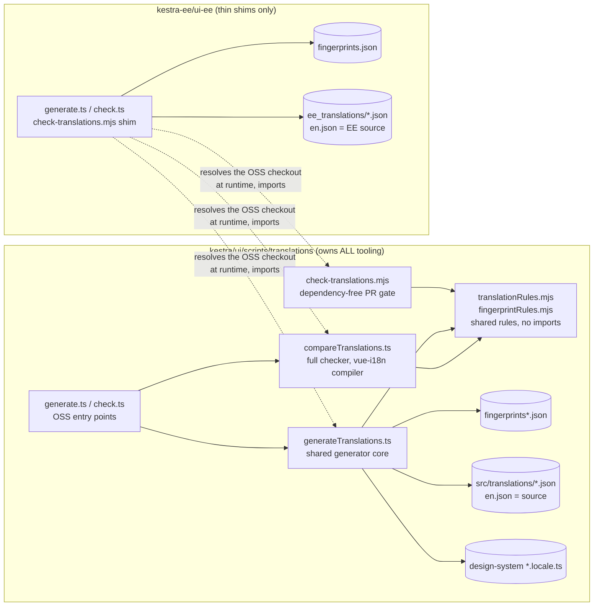
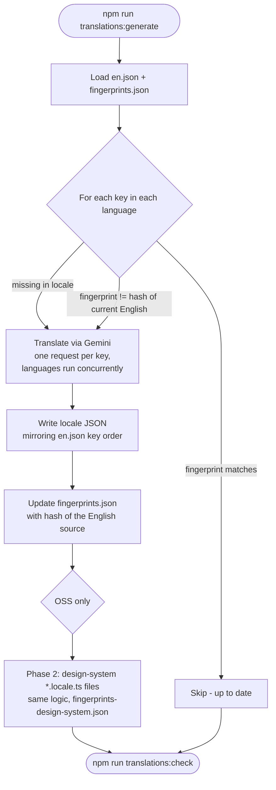
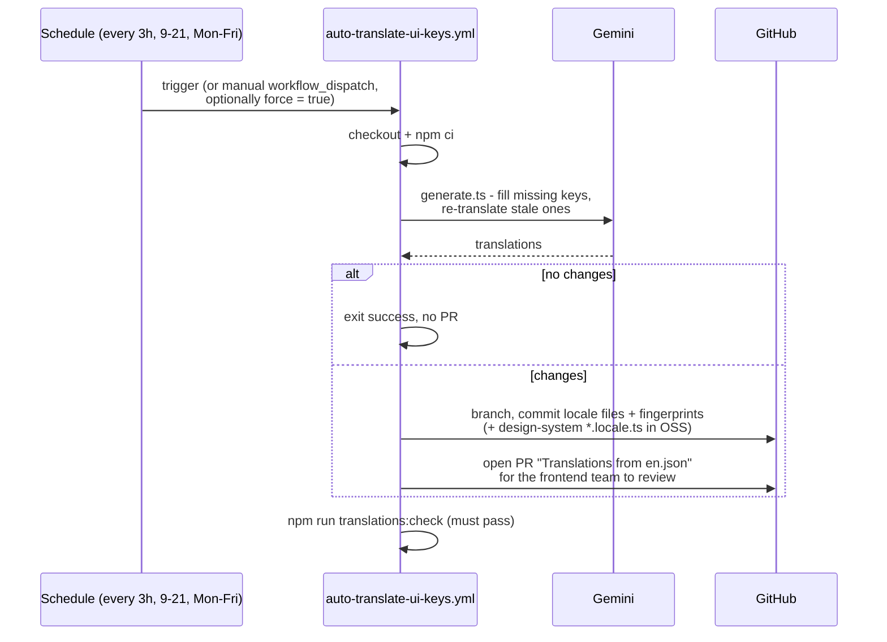
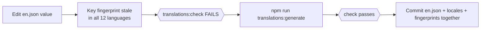

# UI Translations

This directory holds the tooling that keeps the Kestra UI translated. This README explains how the pipeline works, in both this repository and Enterprise (`kestra-ee/ui-ee`), which reuses everything here.

## TL;DR

- English is the single source of truth: [`ui/src/translations/en.json`](../../src/translations/en.json) here, `ui-ee/src/translations/ee_translations/en.json` in EE. The twelve other languages are **generated** from it via Gemini - never hand-written.
- Every key carries a **fingerprint** of the English text its translations were generated from. Editing an English value (even just capitalisation) marks the key stale in all languages and fails the check until regenerated.
- **One shared implementation** lives here. EE keeps only thin entry points that import from this directory, so the two repositories cannot drift into different prompts, rules, or change detection.
- Two commands, the same in both repositories: `npm run translations:generate` (needs `GEMINI_API_KEY`) and `npm run translations:check` (must report no missing / no extra / no stale keys for every language).
- A scheduled GitHub Action runs the generator every 3 hours on weekdays and opens a bot PR when there is anything to translate. A dependency-free PR gate checks key parity and placeholders on every PR.

## The files

| Path | Role |
|------|------|
| [`ui/src/translations/en.json`](../../src/translations/en.json) | OSS English source of truth |
| `ui/src/translations/{de,es,fr,hi,it,ja,ko,pl,pt,pt_BR,ru,zh_CN}.json` | Generated - never edit by hand |
| `ui/packages/design-system/**/*.locale.ts` | Design-system strings, all languages in one file per component; phase 2 of the generator |
| [`fingerprints.json`](fingerprints.json) | English text each translation was generated from |
| [`fingerprints-design-system.json`](fingerprints-design-system.json) | Same, for the `*.locale.ts` files |
| `kestra-ee: ui-ee/src/translations/ee_translations/en.json` | EE English source (merged on top of OSS at runtime; must never redefine an OSS key) |
| `kestra-ee: ui-ee/scripts/translations/` | Thin entry points + EE's own `fingerprints.json` |

## Who owns what

All logic lives in **one place** - this directory. EE entry points locate the OSS checkout at runtime (the sibling `kestra` directory by default, or an explicit `--oss-root` in CI) and import the shared modules from it.



Why the split between `.ts` and `.mjs`: the PR gate must run straight after `actions/checkout`, **before any `npm ci`** - so every rule it applies lives in dependency-free plain JS ([`translationRules.mjs`](translationRules.mjs), [`fingerprintRules.mjs`](fingerprintRules.mjs), [`localeFiles.mjs`](localeFiles.mjs)). File IO, orchestration, and the vue-i18n compiler check stay in `.ts`.

## How generation works

`npm run translations:generate`, run from `ui/` (or `ui-ee/` in EE). Needs `GEMINI_API_KEY`.



Key points:

- **No flag needed for the normal case.** Missing keys are filled, and keys whose English changed are re-translated automatically (detected via fingerprints). Passing `true` forces a full re-translation of everything.
- It calls Gemini **per key**, so large batches take minutes per language - run it in the background for big changes.
- If one locale fails on every run it is a Gemini safety block (`PROHIBITED_CONTENT`), not a flake - reword the English rather than retrying or hand-writing the translation.
- The commit must include the **fingerprints** together with the locale files - committing one without the other makes every key look stale forever, and the bot would loop opening the same PR.

### Translation rules (enforced by the prompt and both checkers)

- **Reserved English terms are never translated**: `flow`, `subflow`, `namespace`, `tenant`, `task`, `trigger`, `id`, `label`, `key`, `value`, `input`, `output`, `log`, `blueprint`, `kv store`, `port`, `worker`, `backfill`, `healthcheck`, `min`, `max`.
- **ALL-CAPS status labels stay English**: `SUCCESS`, `FAILED`, `RUNNING`, `WARNING`, `PAUSED`, ...
- **Placeholders**: vue-i18n uses a **single** brace pair - `{name}`. Each translation must carry exactly the same placeholders as its English source. `{{name}}` is a compile error ("Not allowed nest placeholder"), an invented placeholder renders an empty gap, a dropped one loses the value. Placeholder names are never translated.
- Natural UI terminology over literal translation (German: Execution -> Ausführung, Theme -> Modus).

## How checking works

Two checkers apply the same shared rules at different depths:

| | `translations:check` ([`compareTranslations.ts`](compareTranslations.ts)) | PR gate ([`check-translations.mjs`](check-translations.mjs)) |
|---|---|---|
| Runs | Locally + at the end of the auto-translate workflow | CI, on every PR touching translations or UI source, forks included |
| Needs | `node_modules` (vue-i18n's real message compiler) | Nothing - Node builtins only, runs before `npm ci` |
| Checks | Missing / extra / **stale** keys (fingerprints), placeholders through the actual compiler | Key parity, **stale** keys (fingerprints), placeholder well-formedness + parity with English, untranslated English copies in non-Latin-script locales, EE keys shadowing OSS keys, keys used in code but defined in no `en.json` |

A clean `translations:check` run reports **No missing keys / No extra keys / No stale keys** for every language - anything less blocks the merge. The PR gate applies the same staleness rule, so a fork PR, which gets no generated commit, cannot merge an edited English value without regenerating the other languages either.

The PR gate runs as two ownership-scoped passes so a failure points at the right repository:

- `--scope oss` - every OSS locale matches OSS's own `en.json`, and every literal key the OSS, design-system and topology sources pass to `t()`, `$t()` or `<i18n-t keypath>` exists in OSS's `en.json` or a design-system `*.locale.ts`. A failure is an OSS problem, wherever it is observed.
- `--scope ee` - every EE locale matches EE's `en.json`, no EE key redefines a key OSS already owns, and every literal key `ui-ee/src` uses exists in EE's, OSS's or the design system's English files.

The used-key rule ([`usageRules.mjs`](usageRules.mjs)) only reads literal keys. A key built at runtime - `t(e.message)`, `` t(`errors.${code}`) ``, `t("crud.type." + type)`, `:keypath="expr"` - is skipped, and a key the code tests with `te()` first is allowed to be absent. So a failure is always a real raw-id render. The reverse is not checked: a key nothing references is not reported, because the same dynamic lookups make "unused" impossible to prove from the source.

## CI: the auto-translate bot

Both repositories run `.github/workflows/auto-translate-ui-keys.yml`:



- A **concurrency group** prevents overlapping scheduled runs from opening duplicate PRs for the same change ([#17822](https://github.com/kestra-io/kestra/issues/17822)).
- In EE, the PR gate runs from its own `translation-tests.yml` workflow, deliberately kept off the frontend unit/storybook/e2e path - a translation typo should not block those, and the check needs no build.

## Developer workflow

### Adding a new key

1. Add the key to `en.json` (here, or `ee_translations/en.json` for EE-only strings). Reuse existing generic keys (`cancel`, `save`, `delete`, ...) instead of duplicating.
2. Run `npm run translations:generate`, commit the locale files **and** `fingerprints.json` together.
3. Run `npm run translations:check` - every language must report no missing / extra / stale keys.

Merging with only `en.json` updated also works - the bot fills the languages within a few hours - but the PR gate flags the missing keys, so generating yourself is the clean path.

### Editing an existing English value

**This is a translation change.** The fingerprint no longer matches, so the key is stale in all twelve languages and `translations:check` fails until you regenerate. This is deliberate: before fingerprints existed, edited values silently never propagated and shipped untranslated for years ([#10656](https://github.com/kestra-io/kestra/issues/10656)).

Never paste the English value into other locale files as a placeholder - that used to sneak past the key-parity check and now fails the staleness and untranslated-copy checks anyway.



### Resolving `fingerprints.json` conflicts

Any two branches touching `en.json` will conflict on `fingerprints.json`. **Never hand-merge hashes, never pick a side** - a wrong hash silently marks a drifted key as current and the drift becomes invisible. Regenerate instead:

```bash
git checkout --ours ui/src/translations/*.json ui/scripts/translations/fingerprints*.json
cd ui && npm run translations:generate   # fills whatever the other branch added
npm run translations:check               # must be fully clean
```

(`en.json` itself usually merges cleanly - branches tend to add different keys; it is the generated files that collide.)

### EE specifics

- EE requires this repository checked out beside it (the same requirement as its `settings.gradle`); CI passes `--oss-root` explicitly.
- EE keys must not redefine OSS keys - the gate rejects it. If a key belongs to the other edition, move it to the owning repository.
- When a change spans both repositories, run generate + check in **both**.

### Adding a whole new language

Adding a new locale touches more than the pipeline (locale declaration, moment locale loader, settings selector, plural rules, per-language generator rules, the EE wrapper file). The full step-by-step checklist lives in [ADDING_A_LANGUAGE.md](ADDING_A_LANGUAGE.md).

## History: why it works this way

Until August 2026 the two repositories had forked copies of the generator with different prompts and rules, there was no change detection at all (only key *presence* was checked), and the standard workaround for the missing-keys check was to copy the English value into every locale. The result, tracked in [#10656](https://github.com/kestra-io/kestra/issues/10656): edited English values never propagated, ~220 keys were English in all locales while every check passed, hundreds of ghost keys were paid for on every generator run, and broken placeholders crashed `t()` at render time in some locales.

Fixed by, respectively: fingerprinting + the shared single implementation ([#18042](https://github.com/kestra-io/kestra/pull/18042)), the untranslated-copy backfill ([#18096](https://github.com/kestra-io/kestra/pull/18096)), the ghost-key sweep ([#17859](https://github.com/kestra-io/kestra/pull/17859)), and the placeholder repair + rules ([#17831](https://github.com/kestra-io/kestra/pull/17831)).

One implementation detail worth knowing: fingerprint key paths join with `|` while checker key paths join with `.` (matching how a developer writes `t("a.b.c")`) - the two are not interchangeable, and mixing them up once reported 1,249 healthy keys as stale.
